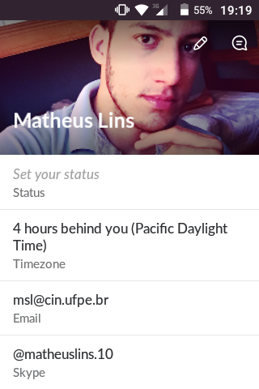
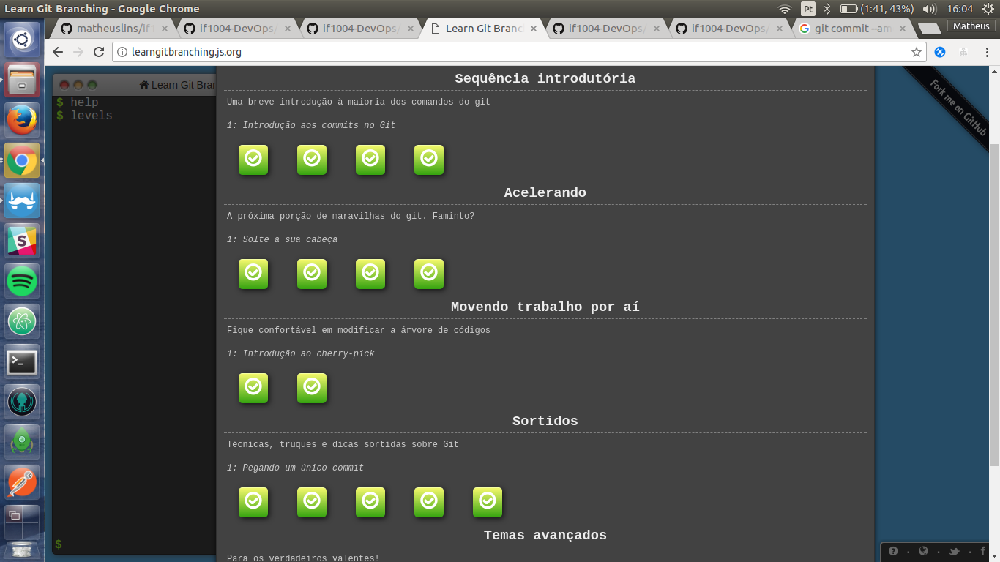
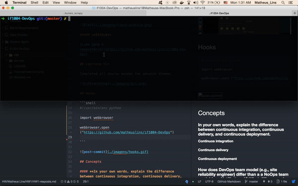

# Homework 1

This homework will prepare me for basic setup for the course.

## Basic course setup

##### **Slack**



##### **Github**

[Link para o repositório](https://github.com/matheuslins/if1004-DevOps)

## Learning Git

Completed all course except the advance themes.



## Hooks

```shell
#!/bin/bash

xdg-open https://github.com/matheuslins/if1004-DevOps
```



## Concepts

#### **In your own words, explain the difference between continuous integration, continuous delivery, and continuous deployment.**

**Continuos integration**

**Continuos delivery**

**Continuous deployment**

#### **How does DevOps team model (e.g., site reliability engineer) differ than a a NoOps team model (e.g. Netflix team)? What differences in architecture allow for a NoOps model?**


#### **Explain the principle of Every Feature is an Experiment**


#### **Be Fast to Deploy but Slow (or Slower) to Release**
