## IF1004 - Seminários em Sistemas de Informação 3
### Aluno: Matheus Lins - msl@cin.ufpe.br

### Homework - Docker Fundamentals Exercises
---
#### Objetivos
##### Executar cada comando e printar as telas
##### Escrever cada comando em um papel e tirar foto
---
### Contents
### 1. Running & Inspecting a Container
#### 1.1 Running Containers  
##### 1.1.1

```bash
$ docker container run ubuntu:16.04 ps -ef
```

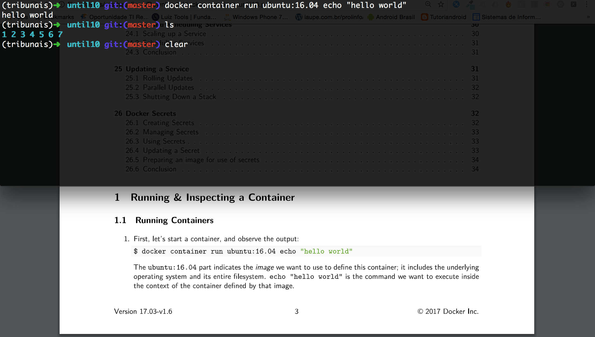

##### 1.1.2
```bash
$ docker container run ubuntu:16.04 ps -ef
```
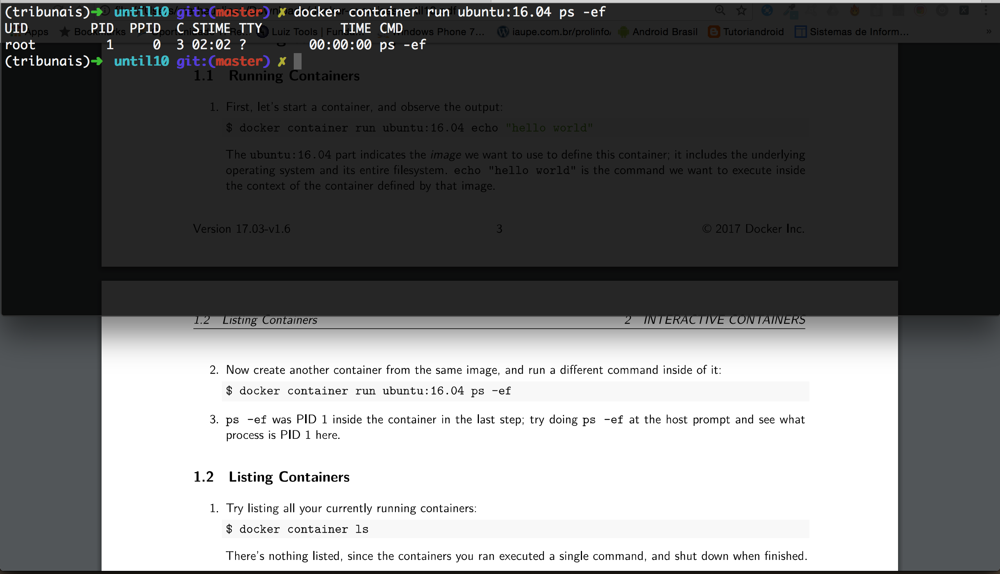

#### 1.2  Listing Containers  
##### 1.2.1
```bash
$ docker container ls
```
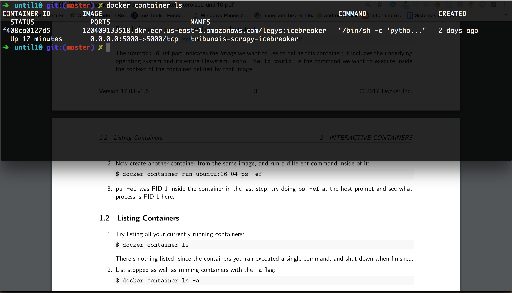

##### 1.2.2
```bash
$ docker container ls -a
```
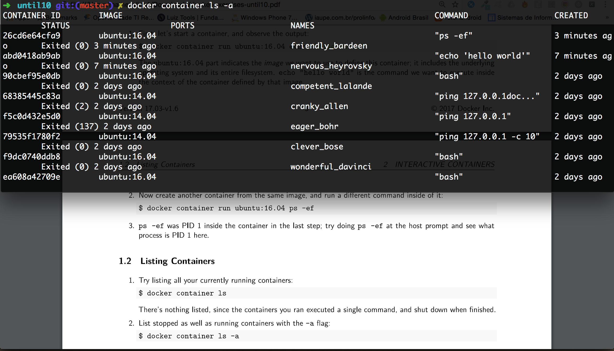   

---
#### 1.3 Conclusion
---
### 2. Interactive Containers
#### 2.1 Writing to Containers  
##### 2.1.1
```bash
$ docker container run -it ubuntu:16.04 bash
$ ls
$ touch test.dat
$ ls
```
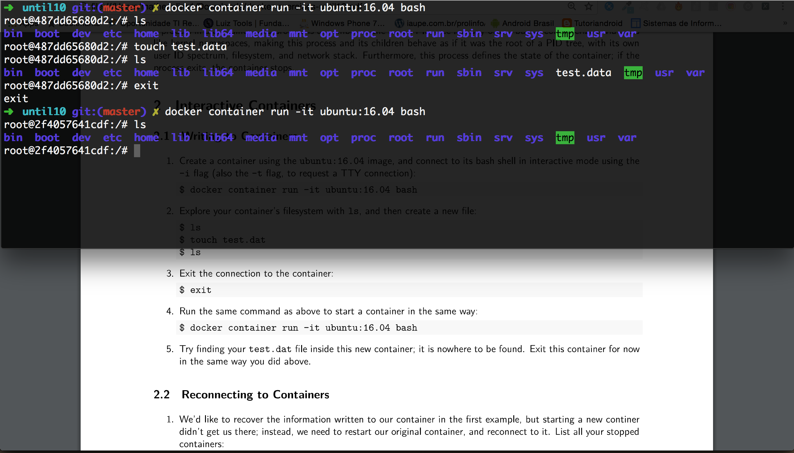

##### 2.2.1
```bash
$ docker container start <container ID>
```
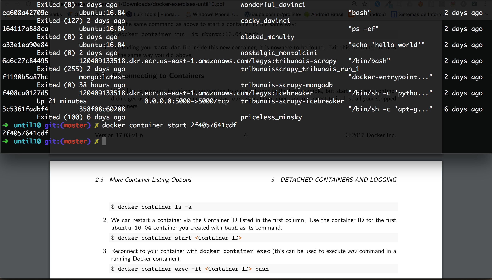

##### 2.2.2
```bash
$ docker container exec -it <container ID> bash
```
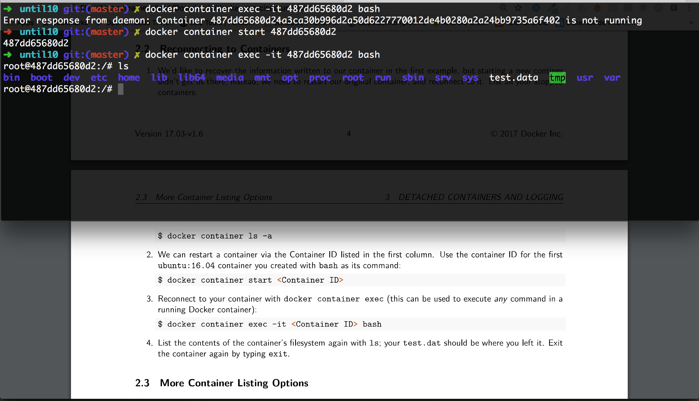

```bash
$ ls
$ exit
```

---

#### 2.3 More Container Listing Options
##### 2.3.1
```bash
$ docker container ls -a --no-trunc
```
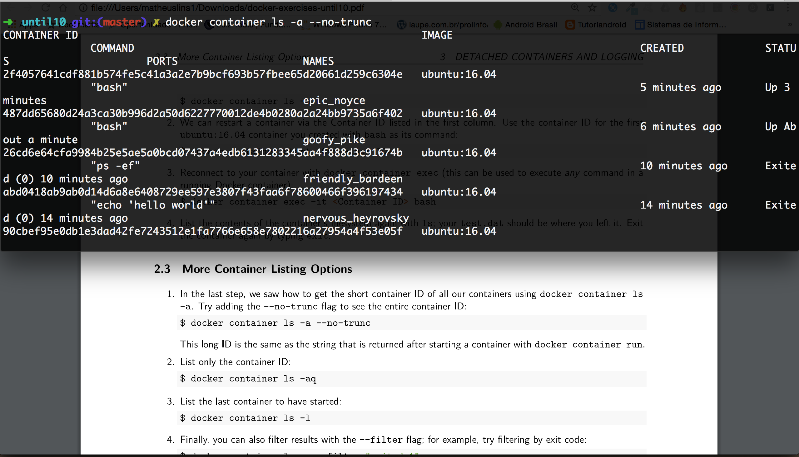

##### 2.3.2
```bash
$ docker container ls -aq
```
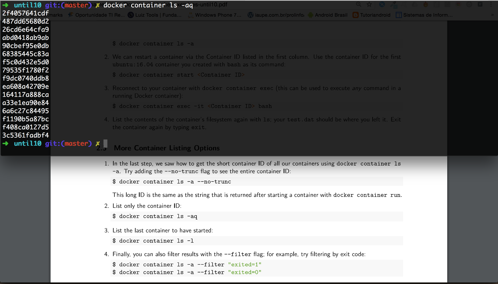

##### 2.3.3
```bash
$ docker container ls -l
```
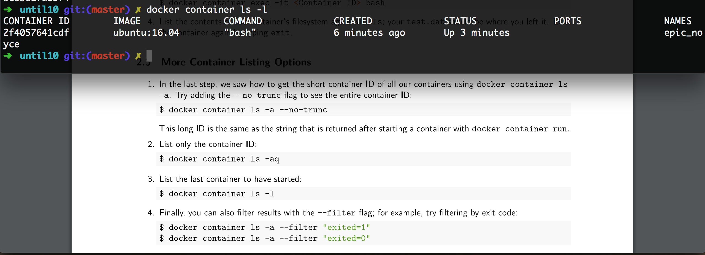

##### 2.3.4
```bash
$ docker container ls -a --filter "exited=1"
$ docker container ls -a --filter "exited=0"
```
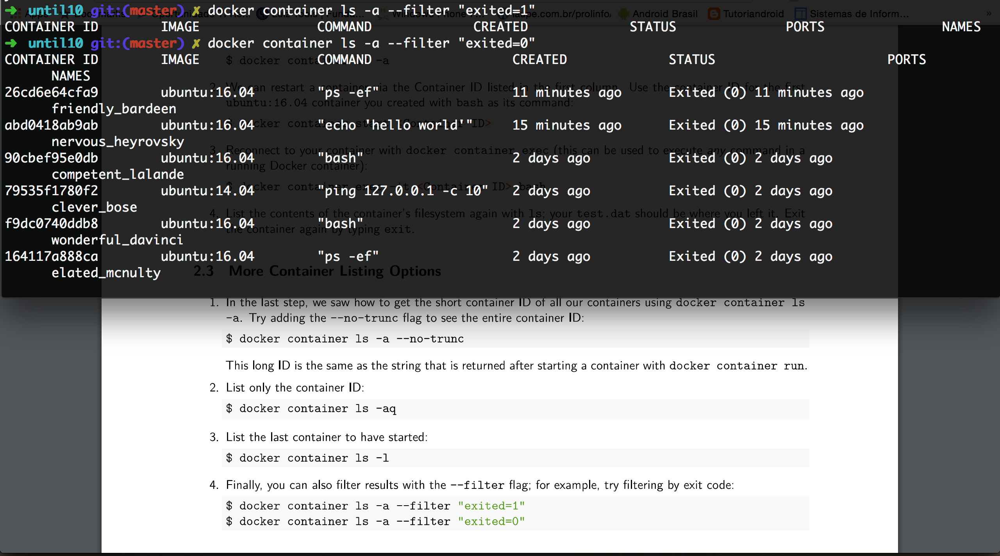
---

#### 2.4 Conclusion

---

### 3. Detached Containers and Logging
#### 3.1 Running a Container in the Background
##### 3.1.1
```bash
$ docker container run ubuntu:14.04 ping 127.0.0.1 -c 10
```
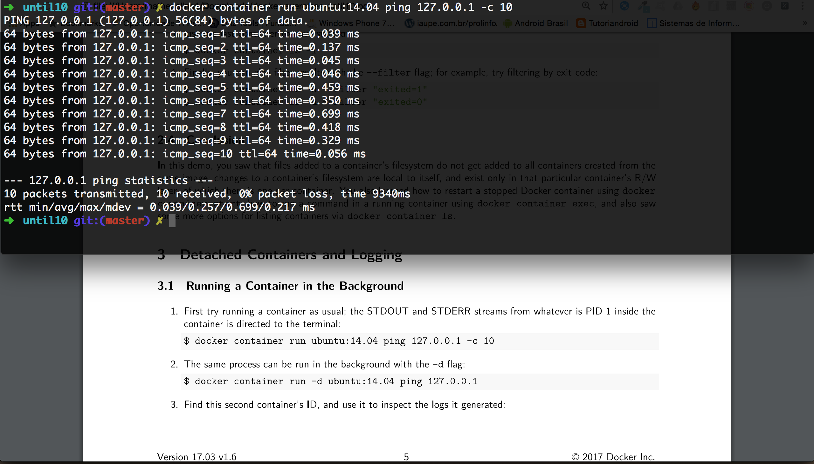

##### 3.1.2
```bash
$ docker container run -d ubuntu:14.04 ping 127.0.0.1
```
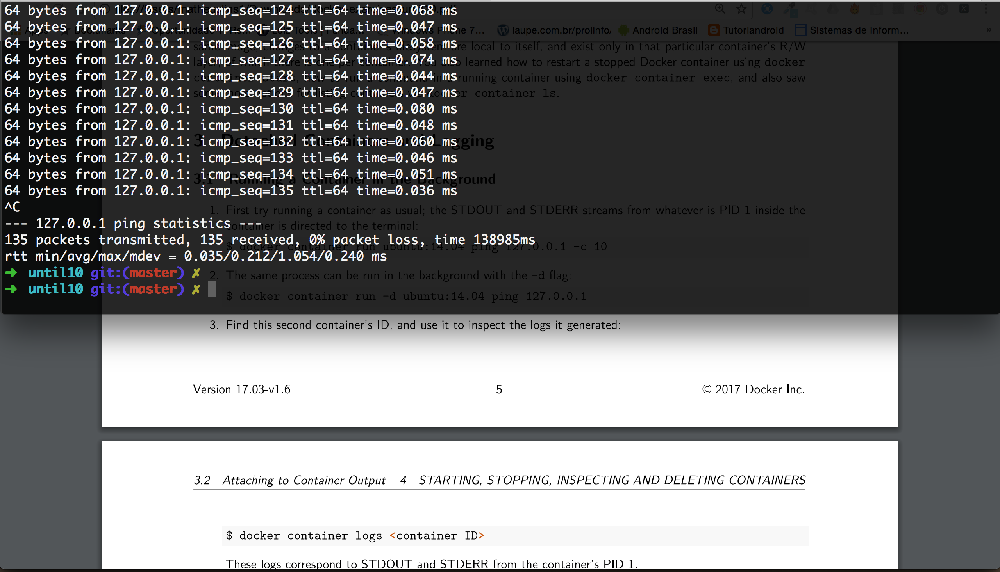

##### 3.1.3
```bash
$ docker container logs <Container ID>
```
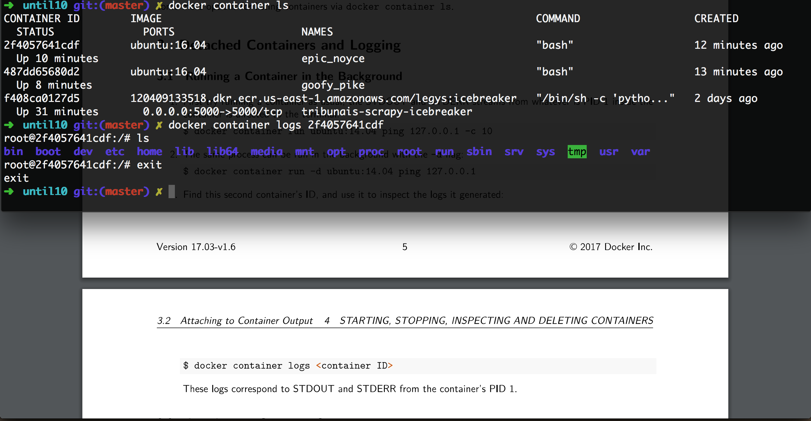

---

#### 3.2 Attaching to Container Output
##### 3.2.1
```bash
$ docker container attach <Container ID>
```
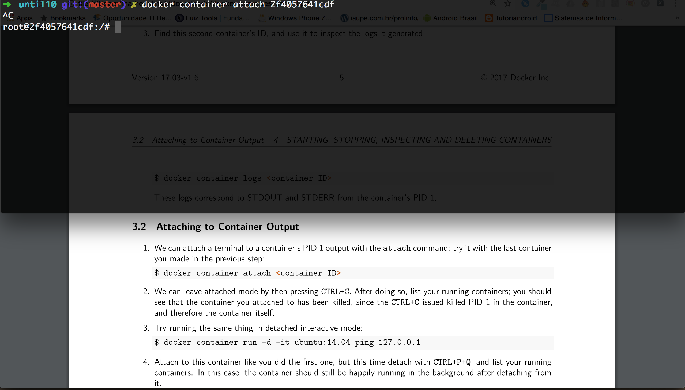

##### 3.2.2
```bash
$ docker container run -d -it ubuntu:14.04 ping 127.0.0.1
```
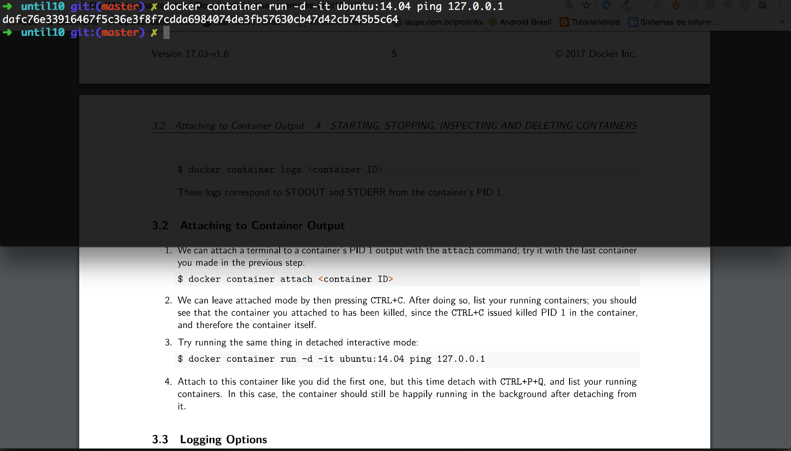

---

#### 3.3 Logging Options
##### 3.3.1
```bash
$ docker container logs --tail 5 <Container ID>
```
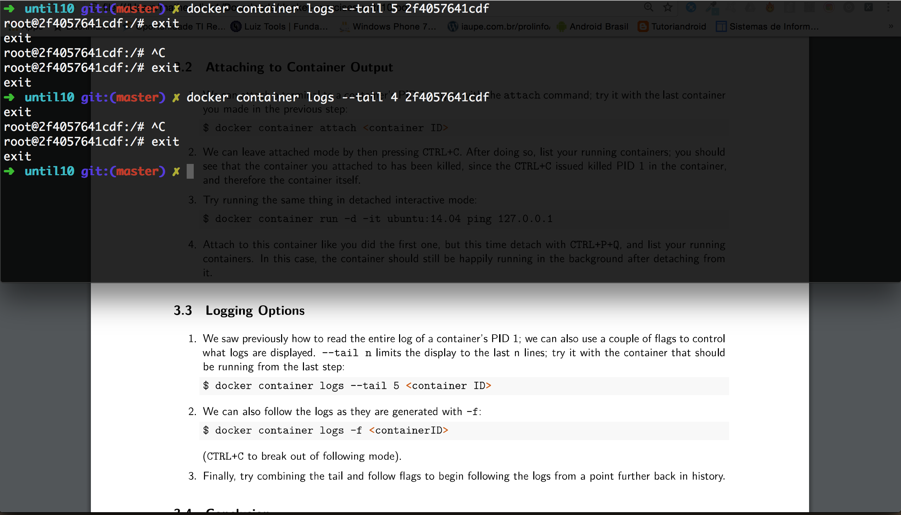

##### 3.3.2
```bash
$ docker container logs -f bcc1660702ec
$ ctrl + c
```
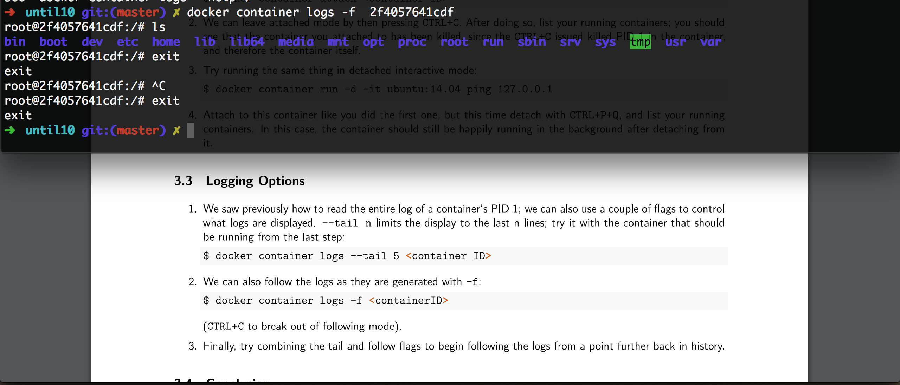

##### 3.3.3
```bash
$ docker container logs --tail 5 -f bcc1660702ec
```


---

#### 3.4 Conclusion

---
### 4. Starting, Stopping, Inspecting and Deleting Containers
#### 4.1 Starting and Restarting Containers
##### 4.1.1
```bash
$ docker container run -d tomcat
$ docker container ls
```


##### 4.1.2
```bash
$ docker container stop 619b31f4212c
$ docker container ls -a
```


##### 4.1.3
```bash
$ docker container start -a 619b31f4212c
```


##### 4.1.4
```bash
$ ctrl + c
```


```bash
$ docker container logs --tail 10 -f 619b31f4212c
```


##### 4.1.5
```bash
$ docker container kill 619b31f4212c
```


---

#### 4.2 Inspecting a Container with docker container inspect
##### 4.2.1
```bash
$ docker container start 619b31f4212c
$ docker container inspect 619b31f4212c
```


##### 4.2.2
```bash
$ docker container inspect 619b31f4212c | grep IPAddress
```


##### 4.2.3
```bash
$ docker container inspect 619b31f4212c | grep Cmd
```


##### 4.2.4
```bash
$ docker container inspect --format='{{.Config.Cmd}}' 619b31f4212c
```


##### 4.2.5
```bash
$ docker container inspect --format='{{.NetworkSettings.IPAddress}}' 619b31f4212c
```


##### 4.2.6
```bash
$ docker container inspect --format='{{json .Config}}' 619b31f4212c
```


---

#### 4.3 Deleting Containers
##### 4.3.1
```bash
$ docker container run -d tomcat
$ docker container run -d tomcat
$ docker container run -d tomcat
$ docker container ls
$ docker container stop
```


##### 4.3.2
```bash
$ docker container ls -a --filter "status=exited"
```


##### 4.3.3
```bash
$ docker container rm <containerID>
$ docker container ls ...
```


##### 4.3.4
```bash
$ docker container rm -f <containerID>
```


##### 4.3.5
Não consegui

---

#### 4.4 Conclusion

---

### 5. Interactive Image Creation
#### 5.1 Modifying a Container
##### 5.1.1
```bash
$ docker container run -it ubuntu:16.04 bash
```


##### 5.1.2
```bash
$ apt-get update
```


```bash
$ apt-get install -y wget vim
```


```bash
$ exit
```


##### 5.1.3
```bash
$ docker container ls -a
$ docker container diff <container id>
```


---

#### 5.2 Capturing Container State as an Image with docker container commit
##### 5.2.1
```bash
$ docker container commit 66bf0580530d dibritodocker/myapp:1.0
```


##### 5.2.2
```bash
$ docker image ls
```


##### 5.2.3
```bash
$ docker container run -it dibritodocker/myapp:1.0 bash
$ which vim
$ which wget
```


##### 5.2.4
```bash
$ touch pbcn.txt
$ docker container commit 66bf0580530d dibritodocker/myapp:1.1
```


##### 5.2.5
```bash
$ docker container diff 66bf0580530d
```


---

#### 5.3 Conclusion

---

### 6. Creating Images with Dockerfiles (1/2)
#### 6.1 Writing and Building a Dockerfile
##### 6.1.1
FROM ubuntu:16.04

RUN apt-get update
RUN apt-get install -y iputils-ping

##### 6.1.2
```bash
$ docker image build -t <username>/myimage
```


##### 6.1.3
```bash
$ docker image ls
```


---
#### 6.2 The Build Cache
##### 6.2.1
```bash
$ docker image build -t <username>/myimage
```


##### 6.2.2


##### 6.2.3
```bash
$ docker image build -t <username>/myimage
```


##### 6.2.4
```bash
$ docker image build -t <username>/myimage
```


##### 6.2.5


```bash
$ docker image build -t <username>/myimage
```


---

#### 6.3 The history Command
##### 6.3.1
```bash
$ docker image history <imageid>
```


##### 6.3.2
```bash
$ docker image build -t <username>/myimage
```


##### 6.3.3
```bash
$ docker image build -t <username>/myimage
```


```bash
$ docker image history <imageid>
```


---

#### 6.4 Conclusion

---

### 7. Creating Images with Dockerfiles (2/2)
#### 7.1 Default Commands via CMD
##### 7.1.1


##### 7.1.2
```bash
$ docker image build -t <username>/myimage:1.0 .
```


##### 7.1.3
```bash
$ docker container run <username>/myimage:1.0
```


##### 7.1.4
```bash
$ docker container run <username>/myimage:1.0 echo "Hello World"
```


---

#### 7.2 Default Commands via ENTRYPOINT
##### 7.2.1


##### 7.2.2
```bash
$ docker image build -t <username>/myimage:1.0
$ docker container run <username>/myimage:1.0
```


##### 7.2.3
```bash
$ docker container run <username>/myimage:1.0 127.0.0.1
```


---

#### 7.3 CMD and ENTRYPOINT Together
##### 7.3.1


##### 7.3.2


##### 7.3.3
```bash
$ docker image build -t <username>/myimage:1.0
$ docker container run <username>/myimage:1.0 <some public ip>
```


##### 7.3.4
```bash
$ docker container run <username>/myimage:1.0
```


---

#### 7.4 Conclusion

---

### 8. Dockerizing an Application
#### 8.1 Setting up a Java App
##### 8.1.1


##### 8.1.2


##### 8.1.3


---

#### 8.2 Dockerizing your App
##### 8.2.1


##### 8.2.2


##### 8.2.3


##### 8.2.4


##### 8.2.5


---

#### 8.3 Restructure your Application
##### 8.3.1
```bash
$ docker container run -it --entrypoint bash <your java image ID>
```


##### 8.3.2
```bash
$ javac -d bin src/HelloWorld.java
```


##### 8.3.3
```bash
$ javac -cp bin HelloWorld
```


##### 8.3.4


##### 8.3.5


##### 8.3.6


##### 8.3.7


##### 8.3.8


##### 8.3.9


##### 8.3.10


---

#### 8.4 Conclusion

---

#### 8.5 Optional Exercise
##### 8.5.1
```bash
$ docker container run --rm -it java:8 bash
```


##### 8.5.2
```bash
$ apt-get update && apt-get install -y nano
```


##### 8.5.3
```bash
$ mkdir javahelloworld
$ cd javahelloworld
$ vim HelloWorld.java
```


##### 8.5.4
```bash
$ javac HelloWorld.java
$ javac HelloWorld
```


---

### 9. Managing Images
#### 9.1 Tagging and Listing Images
##### 9.1.1
```bash
$ docker image pull ubuntu:16.04
```


##### 9.1.2
```bash
$ docker image tag ubuntu:16.04 my-ubuntu:dev
```


##### 9.1.3
```bash
$ docker image ls
```


##### 9.1.4


---

#### 9.2 Sharing Images on Docker Store
##### 9.2.1


##### 9.2.2
```bash
$ docker image my-ubuntu:dev
```


##### 9.2.3


##### 9.2.4
```bash
$ docker image tag my-ubuntu:dev <docker store username>/my-ubuntu:dev
$ docker image tag push <docker store username>/my-ubuntu:dev
```


##### 9.2.5


##### 9.2.6
```bash
$ docker image build -t <docker store username>/my-ubuntu:1.0 .
```


##### 9.2.7
```bash
$  docker image tag push <docker store username>/my-ubuntu:dev
```


##### 9.2.8
```bash
$ docker image ls
$ docker image rm my-ubuntu:dev
```


---

#### 9.3 Private Image
##### 9.3.1


##### 9.3.2
```bash
$ docker image pull <partners docker store name>/my-ubuntu:1.0
```
Their private repo should be invisible to you at this time

##### 9.3.3

---

#### 9.4 Conclusion

---

### 10. Cleanup Commands
##### 10.1
```bash
$ docker system df
```


##### 10.2
```bash
$ docker system prune
```


##### 10.3
```bash
$ docker image prune --force && docker container prune --force && docker volume prune --force && docker network prune --force
```


---
